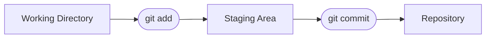

## What Is a Git Repository?

A **Git repository (repo)** is simply a **project folder that Git is tracking**.

Once a folder becomes a Git repository:

- Git can track files inside it
- Git remembers changes you save
- Git builds a history over time

At the start, it’s just a normal folder — Git only adds **tracking**, not magic.

<br><br><br><br><br>

## Creating Your First Repository

Let’s create a new project folder and turn it into a Git repository.

- First, create the folder and navigate into it:

  ```bash
  mkdir ms-git
  cd ms-git
  ```

- Now, initialize Git:

  ```bash
  git init
  ```

- You should see a message saying something like:

  ```bash
  Initialized empty Git repository
  ```

- Run `ls -la` to see the hidden `.git` folder:

  ```bash
  ls -la
  ```

<br><br><br><br><br>

### What just happened?

Git created a hidden folder named:

```bash
.git/
```

This folder stores:

- project history
- commits
- configuration

📌 If you delete the `.git` folder, your project is no longer a Git repository. And you lose all your history and changes.

<br><br><br><br><br>

## Adding Files to the Repository

- Create a file and add some content:

  ```bash
  touch main.py
  echo "print('Hello, Git!')" > main.py
  ```

- Check Git’s status:

  ```bash
  git status
  ```

- Git will tell you:

  - `main.py` is **untracked**
  - Git sees it, but is not tracking it yet

<br><br><br>

### Stage the File

- To add `main.py` to the staging area:

  ```bash
  git add main.py
  ```

- Check Git's status again:

  ```bash
  git status
  ```

- Git will tell you:
  - `main.py` is **staged**
  - It's ready to be saved

> Now `main.py` is **staged** — ready to be saved.

<br><br><br>

### Make Your First Commit

- To save `main.py` to the repository:

  ```bash
  git commit -m "Initial commit"
  ```

- Run `git status` again to confirm:

  ```bash
  git status
  ```

- Git will tell you:
  - `main.py` is no longer **staged**
  - It's been saved to the repository

🎉 Congratulations!
You just created your **first version** of the project.

> This commit is a snapshot of your project at this moment in time.

<br><br><br><br><br>

## How Git Thinks About Your Project

To understand Git, you need to understand **three places**.



📌 This mental model will explain **almost every Git command** you’ll learn.

<br><br><br><br><br>

## Working Directory

This is your actual project folder:

- where you write code
- where you edit files

Any change you make starts here.

<br><br><br><br><br>

## Staging Area

- This is where you tell Git:

> “These are the changes I want to save next.”

- You move changes here using:

```bash
git add file_name
```

<br><br><br><br><br>

## Repository

This is Git’s memory:

- every commit lives here
- nothing is lost unless you delete history

When you run:

```bash
git commit
```

Git takes everything from the staging area and stores it permanently.

<br><br><br><br><br>

## Key Terms (Keep These in Mind)

- **Repository (repo):** A project folder tracked by Git
- **Commit:** A saved snapshot of the entire project at a point in time
- **Working directory:** Your current files and edits

- **Staging area:** The place where changes wait before being committed

- **Tracked file:** A file Git knows about

- **Untracked file:** A file Git sees but is not tracking yet

You don’t need to memorize these — you’ll use them repeatedly.
