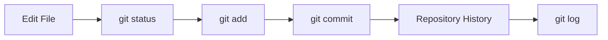

## The Daily Git Workflow

- Almost all Git usage follows the same simple pattern:



- As a developer, you will repeat this cycle many times every day.

<br><br><br><br><br>

## Let's Make Another Commit

Let's continue from the repository we created in the previous lesson.

<br><br><br>

- Add another task to `todo.txt`:

```bash
echo "Complete Git assignment" >> todo.txt
```

- See what has changed

```bash
git diff
```

<br><br><br>

- Check Git Status

```bash
➜  ms-git git:(main) ✗ git status
On branch main
Changes not staged for commit:
        modified:   todo.txt

no changes added to commit
➜  ms-git git:(main) ✗
```

📌 Git sees the change, but it is not ready to be committed yet.

<br><br><br>

- Stage the Change

```bash
git add todo.txt
```

- Check the status again:

```bash
➜  ms-git git:(main) ✗ git status
On branch main
Changes to be committed:
        modified:   todo.txt

➜  ms-git git:(main) ✗
```

📌 This moves changes from the working directory to the staging area.

<br><br><br>

- Create another commit

```bash
git commit -m "Add assignment todo"

cat todo.txt
```

- Verify Everything

```bash
➜  ms-git git:(main) git status
On branch main
nothing to commit, working tree clean
➜  ms-git git:(main)
```

📌 Your changes are now safely stored in Git history.

<br><br><br><br><br>

## Viewing History

Git stores every commit in your project's history.

To view the history:

```bash
git log
```

This shows:

- commit IDs
- author
- date
- commit messages

Example: `git log` will display something like this:

```bash
commit f157ead349e0dac2c244e2d3158169c9706dbb06 (HEAD -> main)
Author: Shafayetul Huda Sadi <shafayet.sadi@gmail.com>
Date:   Thu Jun 25 10:50:54 2026 +0600

    Add assignment todo

commit d0680cc7f5ae7590c69d7bdcdfb05bcd502c85f4
Author: Shafayetul Huda Sadi <shafayet.sadi@gmail.com>
Date:   Thu Jun 25 10:43:55 2026 +0600

    Create initial todo list
(END)
```

<br><br><br>

- A shorter version

```bash
git log --oneline
```

```bash
f157ead (HEAD -> main) Add assignment todo
d0680cc Create initial todo list
```

- Each line represents a snapshot in your project's history.

📌 If Git opens the log in a pager, press `q` to exit.

<br><br><br><br><br>

## Understanding the Commands

<br><br><br>

### git status

- Shows the current state of your repository.
- Use it whenever you are unsure what Git is doing.

📌 While learning Git, `git status` is your best friend.

<br><br><br>

<br><br><br>

### git diff

- Shows the differences between your working directory and the staging area.

```bash
git diff
```

- Use it to review your changes before staging them.

### git add

- Moves changes from the **working directory** to the **staging area**.

  ```bash
  git add todo.txt
  ```

- Think of it as selecting what you want to save next.

<br><br><br>

### git commit

- Creates a snapshot from everything currently staged.

```bash
git commit -m "Add assignment todo"
```

- Think of a commit as pressing **Save Game** in a video game.

- If you never save, Git cannot take you back later.

<br><br><br>

### git log

- Shows the history of commits.

```bash
git log --oneline
```

- This lets you see how your project evolved over time.

<br><br><br><br><br>

## Important Reminder

Git does not automatically create history.

```text
Edit File
    ↓
Save File
    ↓
Still only on your computer
    ↓
git commit
    ↓
Saved in Git history
```

> If you never commit your work, Git has nothing to restore later.
