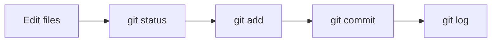

## The Daily Git Workflow

- Almost all Git usage follows the same simple pattern:



- As a developer, you will repeat this cycle many times every day.

<br><br><br><br><br>

## Let's Make Another Commit

Let's continue from the repository we created in the previous lesson.

<br><br><br>

### Step 1: Modify a File

Add another line to `main.py`:

```bash
echo "print('Learning Git!')" >> main.py
```

Now the file has changed.

<br><br><br>

### Step 2: Check the Status

Ask Git what changed:

```bash
git status
```

You should see something similar to:

```text
Changes not staged for commit:
  modified: main.py
```

📌 Git sees the change, but it is not ready to be committed yet.

<br><br><br>

### Step 3: Stage the Change

Tell Git you want to include the change in the next commit:

```bash
git add main.py
```

Check the status again:

```bash
git status
```

You should see something similar to:

```text
Changes to be committed:
  modified: main.py
```

📌 This moves changes from the working directory to the staging area.

<br><br><br>

### Step 4: Create a Commit

Save the staged change:

```bash
git commit -m "Add another print statement"
```

This creates a new snapshot of your project.

<br><br><br>

### Step 5: Verify Everything

Check the status one more time:

```bash
git status
```

You should see:

```text
nothing to commit, working tree clean
```

📌 Your changes are now safely stored in Git history.

<br><br><br><br><br>

## Viewing History

Git stores commits in a timeline called the project history.

To view the history:

```bash
git log
```

This shows:

- commit IDs
- author
- date
- commit messages

<br><br><br>

### A shorter version

```bash
git log --oneline
```

Example:

```text
8a7c123 Add another print statement
2b9d456 Initial commit
```

- Each line represents a snapshot in your project's history.

📌 If Git opens the log in a pager, press `q` to exit.

<br><br><br><br><br>

## Understanding the Commands

<br><br><br>

### git status

- Shows the current state of your repository.
- Use it whenever you are unsure what Git is doing.

📌 While learning Git, `git status` is your best friend.

<br><br><br>

### git add

- Moves changes from the **working directory** to the **staging area**.

  ```bash
  git add main.py
  ```

- Think of it as selecting what you want to save next.

<br><br><br>

### git commit

- Creates a snapshot from everything currently staged.

```bash
git commit -m "Add another print statement"
```

- Think of a commit as pressing **Save Game** in a video game.

- If you never save, Git cannot take you back later.

<br><br><br>

### git log

- Shows the history of commits.

```bash
git log --oneline
```

- This lets you see how your project evolved over time.

<br><br><br><br><br>

## Important Reminder

Git does not automatically create history.

- Editing a file is not enough
- Saving a file is not enough
- Only a commit creates a new snapshot

> If you never commit your work, Git has nothing to restore later.
