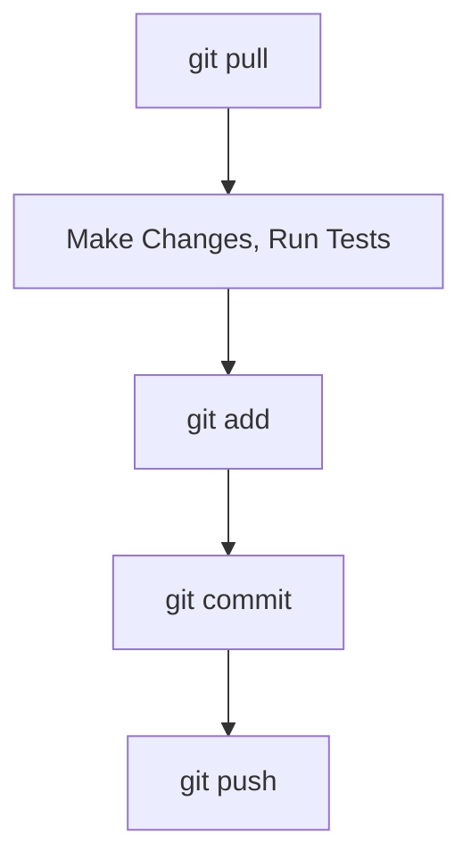

## Clone vs Pull

When working with GitHub, you'll usually find yourself in one of these two situations.

<br><br><br>

### Clone

> You want a repository on your computer, but you don't have it yet.

Imagine you join a hackathon team.

Your teammate already created a GitHub repository and added some code.

How do you get a copy on your computer?

- You clone it.

  ```bash
  git clone
  ```

<br><br><br>

### Pull

> You already have the repository on your computer, but new changes have been pushed to GitHub.

Now imagine you cloned the repository yesterday.

Today, your teammate pushed new commits to GitHub.

Your local copy is now outdated.

How do you get the latest changes?

- You pull them.

  ```bash
  git pull
  ```

<br><br><br><br><br>

## Clone the Repository

Run:

```bash
git clone https://github.com/USERNAME/REPOSITORY.git
```

For example:

```bash
git clone https://github.com/example-user/ms-git.git
```

Git will:

- Download all project files
- Download the entire commit history
- Create a local repository
- Automatically connect it to GitHub

📌 Public repositories can usually be cloned without authentication. Private repositories require permission.

<br><br><br>

After cloning:

```bash
cd REPOSITORY
```

You are now ready to start working.

You can edit files, create commits, and push changes just like any other Git repository.

📌 Cloning gives you much more than just the files — it gives you the complete Git repository and its history.

<br><br><br><br><br>

## The Hidden Magic: _origin_

In the previous lesson, we connected a repository using:

```bash
git remote add origin ...
```

<br><br><br>

Notice that we did **not** run that command when cloning.

Why?

Because Git automatically creates the `origin` remote when cloning a repository.

Verify it:

```bash
git remote -v
```

You should see something similar to:

```text
origin  https://github.com/USERNAME/REPOSITORY.git (fetch)
origin  https://github.com/USERNAME/REPOSITORY.git (push)
```

📌 When you clone a repository, Git automatically knows where it came from.

<br><br><br><br><br>

## Pull the Latest Changes

Run:

```bash
git pull origin main
```

Git will:

- Download new commits from GitHub
- Update your local repository
- Merge the new changes into your current branch

If everything is already up to date, Git will tell you:

```text
Already up to date.
```

<br><br><br><br><br>

## A Good Team Workflow

When working with other people, a common workflow looks like this:



Following this workflow helps keep your local repository up to date and reduces the chance of merge conflicts when collaborating with others.
