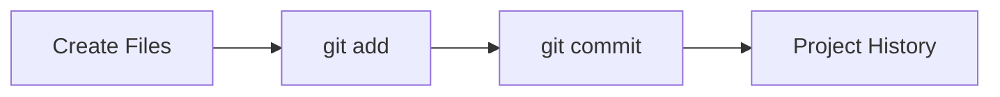

## From Commands to a Real Project

So far, we have been learning Git commands in isolation.

Now it's time to use Git the way developers actually use it:

```text
Create Project
    ↓
Write Code
    ↓
Commit Changes
    ↓
Improve Project
    ↓
Commit Again
```

<br><br><br><br><br>

## The Project

We will build a small command-line number guessing game.

The rules are simple:

1. The computer picks a random number
2. The user makes a guess
3. The program tells whether the guess is correct

The goal is not to build a perfect game.

The goal is to practice Git while building something real.

<br><br><br><br><br>

## Step 1: Create the Project

Create a project folder:

```bash
mkdir cli-guess-game
cd cli-guess-game
```

Create some basic files:

```bash
mkdir src
touch README.md
```

Initialize Git:

```bash
git init
```

Check the folder:

```bash
ls -la
```

You should see:

```text
.git/
README.md
src/
```

📌 The presence of `.git` means this folder is now a Git repository.

<br><br><br><br><br>

## Step 2: Create Version 1 of the Game

Create:

```text
src/main.py
```

Add the following code:

```python
import random

number = random.randint(1, 10)

guess = int(input("Guess a number between 1 and 10: "))

if guess == number:
    print("Correct!")
else:
    print("Wrong! The number was", number)
```

<br><br><br>

Run the program:

```bash
python3 src/main.py
```

Example:

```text
Guess a number between 1 and 10: 7
Wrong! The number was 3
```

If the program runs successfully, we are ready to save Version 1.

<br><br><br><br><br>

## Step 3: Check Git's Status

Ask Git what it sees:

```bash
git status
```

You should notice:

```text
README.md
src/main.py
```

are currently untracked.

Git sees them, but Git is not tracking them yet.

<br><br><br><br><br>

## Step 4: Create the First Project Commit

Stage the project files:

```bash
git add README.md src/main.py
```

Verify:

```bash
git status
```

You should now see that the files are staged.

<br><br><br>

Create your first commit:

```bash
git commit -m "Create initial guessing game"
```

🎉 Congratulations!

You have just created the first saved version of your project.

📌 A commit is not just a backup—it is a named checkpoint in your project's history.

<br><br><br><br><br>

## Step 5: View the History

Check the project's history:

```bash
git log --oneline
```

You should see something similar to:

```text
a1b2c3d Create initial guessing game
```

Right now, there is only one commit.

In the next lessons, we will continue improving the project and adding more commits.

Over time, this history will grow.

<br><br><br><br><br>

## Understanding What Just Happened

A few minutes ago, this project did not exist.

Now Git has:

- A repository
- A working program
- A saved snapshot
- A project history



This is the core workflow you will repeat throughout your development career.

<br><br><br><br><br>

## Don't Worry About the Code

The guessing game itself is not important.

You can follow along using:

- Python
- C
- C++
- Java
- Any programming language you already know.

The Git workflow remains exactly the same.

What matters is learning to:

```text
Build
    ↓
Commit
    ↓
Improve
    ↓
Commit Again
```

That is how real projects evolve.
