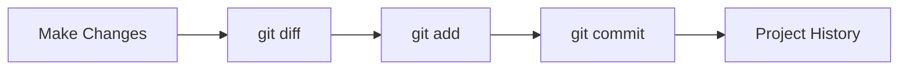

## Projects Grow One Commit at a Time

In the previous lesson, we created Version 1 of our guessing game.

Right now, our project history looks something like this:

```text
a1b2c3d Create initial guessing game
```

Real software is never finished after the first commit.

<br><br><br>

Developers continuously:

```text
Add Feature
    ↓
Commit

Improve Feature
    ↓
Commit

Fix Problem
    ↓
Commit
```

Git helps us record that journey.

<br><br><br><br><br>

## A Good Commit Mindset

A commit should represent one clear idea.

Examples:

- Add a feature
- Fix a bug
- Improve an existing feature
- Refactor code

Avoid commits like:

```text
Update stuff
Fix things
Changes
```

Instead, prefer:

```text
Add limited attempts
Validate user input
Improve game messages
```

Good commit messages make project history easier to understand.

<br><br><br><br><br>

## Version 2: Add Limited Attempts

Let's improve our game.

Instead of giving the player only one chance, we'll allow three attempts.

Update `src/main.py`:

```python
import random

number = random.randint(1, 10)
attempts = 3

while attempts > 0:
    guess = int(input("Guess a number between 1 and 10: "))

    if guess == number:
        print("Correct!")
        break

    attempts -= 1
    print("Wrong! Attempts left:", attempts)

if attempts == 0:
    print("Game over! The number was", number)
```

<br><br><br>

Before creating a commit, let's inspect the changes:

```bash
git diff
```

Git shows exactly what changed since the previous commit.

📌 Use `git diff` whenever you want to review your work before staging.

> After running git add, git diff no longer shows those staged changes. You can still view them with `git diff --staged`.

<br><br><br>

Save the feature:

```bash
git add src/main.py
git commit -m "Add limited attempts"
```

<br><br><br><br><br>

## Version 3: Validate User Input

Try entering:

```text
abc
```

The program crashes.

Let's fix that.

Update the input section:

```python
user_input = input("Guess a number between 1 and 10: ")

if not user_input.isdigit():
    print("Please enter a valid number.")
    continue

guess = int(user_input)
```

Now the game handles invalid input more gracefully.

<br><br><br>

Review the changes:

```bash
git diff
```

Then save them:

```bash
git add src/main.py
git commit -m "Validate user input"
```

<br><br><br><br><br>

## Viewing the Project History

Let's see how our project has evolved.

Run:

```bash
git log --oneline
```

You should see something similar to:

```text
e4f5g6h Validate user input
b2c3d4e Add limited attempts
a1b2c3d Create initial guessing game
```

Notice what happened.

Each commit tells part of the story of the project.

Instead of one giant snapshot, we now have a timeline.

<br><br><br><br><br>

## Why Small Commits Matter

Imagine something breaks tomorrow.

Which history is easier to understand?

```text
Commit 1
Commit 2
Commit 3
```

or

```text
One huge commit containing everything
```

Small commits make it easier to:

- Understand changes
- Find bugs
- Review work
- Collaborate with others

This is one of the most important habits professional developers develop.

<br><br><br><br><br>

## The Workflow You Just Practiced

Today, you followed the same workflow developers use every day:



- You started with Version 1.
- Then you improved it.
- Then you improved it again.
- And Git recorded every step along the way.

That is the real power of commits.

Each commit tells part of the story of your project.
